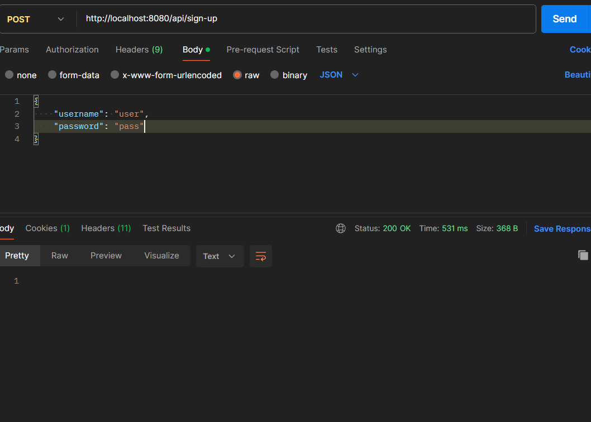
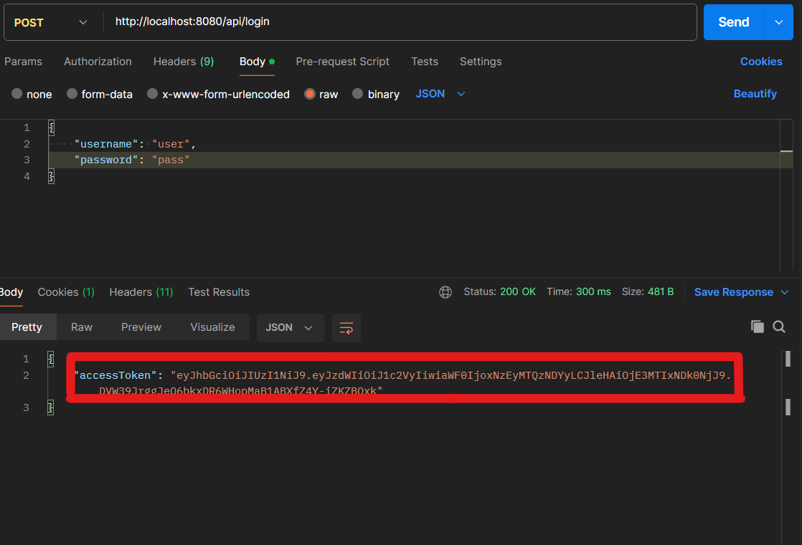

# Wallet Service

## Summary

Imagine that you have a wallet service. We want to use this service to integrate with our payment system.

## Details

1. Users can add new wallets to this service. The wallet supports different currencies.
2. Users can deposit/withdraw the requested amount to the wallet that you have created.
3. Users can query the current balance.
4. All transactions could be able to report.


How to run the project:
-----------------------

On a separate terminal and since this is a maven project you just need to go to the root of the project and perform the command:
```
mvn clean install
```
or if you don't have installed maven on your OS

```
mvnw clan install
```
This will run the unit tests of the project and create the jar file.

After having the jar file you can simply run:

```
java -jar target/wallet-service.jar
```

Since this is a Spring Boot project, you can also run the project with below command;
```
mvn spring-boot:run
```

or if you don't have installed maven on your OS
```
mvnw spring-boot:run
```

The project will run on port 8080 (configured as default).


How to test the project:
-----------------------

* _JWT Authentication_ is enabled for the project. For this reason, it is necessary to get a valid token at first.
* If there is a registered user on the system, this user can be used to get a JWT token. If there is no user, it is necessary to sign up a user;

**Request URL;**

`http://localhost:8080/api/sign-up`


**Request Body;**

`{
"username": "user",
"password": "pass"
}`






* After getting a valid token, you can test the project from Swagger API UI. To access Swagger UI, go to;
* http://localhost:8080/swagger-ui/index.html


* Taken JWT token must be written to Authorization section of Swagger;


